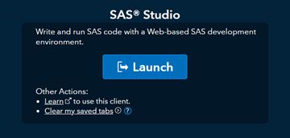
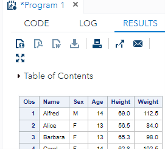

# Learner Preparation – SAS

Active participation in the SAS part of Dataset-JSON workshop requires a SAS profile.

1. In case you do not have a SAS profile, create it at: <https://www.sas.com/profile/ui/#/create>  
   You will get an email with the subject: **Please activate your SAS Profile**.
2. Once your SAS profile has been created, sign in to <https://communities.sas.com/> and finalize your profile.
3. Set up SAS On-Demand account by signing in with your SAS profile at: <https://welcome.oda.sas.com/>
  This might take 10 minutes, after which you will receive an email:
  **You are ready to start using SAS OnDemand for Academics**.
4. Go to <https://welcome.oda.sas.com/> and click the blue button to **Launch** SAS Studio.




In the CODE screen enter some code:

```sas
proc print data=sashelp.class;  
run;
```

Then press the 'running person' button.  
You should get a RESULT:


